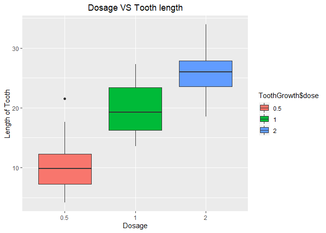

## Overview    
The purpose of this project is to determine whether there is any relation of the mode of delivery of Vitamin C to the length of the teeth or the dosage quantity of the same to the length of the teeth. To determine this we will be using "ToothGrowth" dataset which is present in R datasets package.  


## Loading Libraries

```r
library(datasets)
library(ggplot2)
```

```
## Warning: package 'ggplot2' was built under R version 3.6.1
```
  

## Data
Before starting any exploratory analysis, we need a fair idea of the about the content of the dataset available to us.  


```r
# Loading Data.
data("ToothGrowth")
head(ToothGrowth)
```

```
##    len supp dose
## 1  4.2   VC  0.5
## 2 11.5   VC  0.5
## 3  7.3   VC  0.5
## 4  5.8   VC  0.5
## 5  6.4   VC  0.5
## 6 10.0   VC  0.5
```

```r
# Identify null data present in the dataset.
sum(!complete.cases(ToothGrowth))
```

```
## [1] 0
```

```r
# Checking properties of the dataset available.
str(ToothGrowth)
```

```
## 'data.frame':	60 obs. of  3 variables:
##  $ len : num  4.2 11.5 7.3 5.8 6.4 10 11.2 11.2 5.2 7 ...
##  $ supp: Factor w/ 2 levels "OJ","VC": 2 2 2 2 2 2 2 2 2 2 ...
##  $ dose: num  0.5 0.5 0.5 0.5 0.5 0.5 0.5 0.5 0.5 0.5 ...
```

```r
summary(ToothGrowth)
```

```
##       len        supp         dose      
##  Min.   : 4.20   OJ:30   Min.   :0.500  
##  1st Qu.:13.07   VC:30   1st Qu.:0.500  
##  Median :19.25           Median :1.000  
##  Mean   :18.81           Mean   :1.167  
##  3rd Qu.:25.27           3rd Qu.:2.000  
##  Max.   :33.90           Max.   :2.000
```

```r
ToothGrowth$dose <- as.factor(ToothGrowth$dose)
```


## Expaloratory Data Analysis  

Plotting boxplot to get a sense of whether there is any relation between the mode of delivery of vitamin C and length of tooth.

```r
g1 <- ggplot(data = ToothGrowth)
g1 + geom_boxplot(aes(ToothGrowth$supp, ToothGrowth$len, fill = ToothGrowth$supp)) + 
      labs(title = "Mode of delivery VS Tooth length", x = "Mode of Delivery", y = "Length of Tooth") + 
      theme(plot.title = element_text(hjust = 0.5))
```

<!-- -->

Plotting boxplot to get a sense of whether there is any relation between the dose of vitamin C and length of tooth.

```r
g2 <- ggplot(data = ToothGrowth)
g2 + geom_boxplot(aes(ToothGrowth$dose, ToothGrowth$len, fill = ToothGrowth$dose)) + 
      labs(title = "Dosage VS Tooth length", x = "Dosage", y = "Length of Tooth") + 
      theme(plot.title = element_text(hjust = 0.5))
```

<!-- -->


## Hypothesis Testing

We will perform T test on both scenarios to figure out whether there is any relation between:  
1. Mode of delivery and tooth length.  
2. Dosage and tooth length.  

For first scenario we will define H0 as: Mode of delivery of Vitamin C does not have any influence on tooth growth.  

```r
t.test(ToothGrowth$len[ToothGrowth$supp == "VC"], ToothGrowth$len[ToothGrowth$supp == "OJ"], paired = FALSE)
```

```
## 
## 	Welch Two Sample t-test
## 
## data:  ToothGrowth$len[ToothGrowth$supp == "VC"] and ToothGrowth$len[ToothGrowth$supp == "OJ"]
## t = -1.9153, df = 55.309, p-value = 0.06063
## alternative hypothesis: true difference in means is not equal to 0
## 95 percent confidence interval:
##  -7.5710156  0.1710156
## sample estimates:
## mean of x mean of y 
##  16.96333  20.66333
```
We can infer the following from this test:  

- the p-value is 0.06, i.e. nearly the significance level α = 0.05. So we do not reject the null hypothesis, but as 0.05≦ p-value ≦0.1, it is not clear whether we should reject the null hypothesis.  
- the confidence interval contains 0, so the test is not significant.  
  
For second scenario we will define H0 as: Dose of Vitamin C does not have any influence on tooth growth.

```r
t.test(ToothGrowth$len[ToothGrowth$dose == 0.5], ToothGrowth$len[ToothGrowth$dose == 1], paired = FALSE)
```

```
## 
## 	Welch Two Sample t-test
## 
## data:  ToothGrowth$len[ToothGrowth$dose == 0.5] and ToothGrowth$len[ToothGrowth$dose == 1]
## t = -6.4766, df = 37.986, p-value = 1.268e-07
## alternative hypothesis: true difference in means is not equal to 0
## 95 percent confidence interval:
##  -11.983781  -6.276219
## sample estimates:
## mean of x mean of y 
##    10.605    19.735
```

We can infer the following from this test:  

- the p-value is nearly 0, so we can obviously reject H0
- the confidence interval does not contain 0.
So, from the above result we can infer that dosage of Vitamin C clearly has an impact on tooth length.  
  
From the above result and the boxplot we obtained from our exploratory analysis, we can guess that the result will be the same even if we perform the T test for dosage = 1 and dosage = 2 but just to make sure that our assumption is correct, we will perform a t test for the same.

```r
t.test(ToothGrowth$len[ToothGrowth$dose == 1], ToothGrowth$len[ToothGrowth$dose == 2], paired = FALSE)
```

```
## 
## 	Welch Two Sample t-test
## 
## data:  ToothGrowth$len[ToothGrowth$dose == 1] and ToothGrowth$len[ToothGrowth$dose == 2]
## t = -4.9005, df = 37.101, p-value = 1.906e-05
## alternative hypothesis: true difference in means is not equal to 0
## 95 percent confidence interval:
##  -8.996481 -3.733519
## sample estimates:
## mean of x mean of y 
##    19.735    26.100
```
The result obtained is the same as the above test so we can be assured that dosage of Vitamin C has and effect on tooth growth in guinea pigs.


## Conclusion
- We cannot infer that there is any relation between the mode of delivery of vitamin C and tooth growth in guinea pigs.
- We are sure that there is a relation between the dosage of vitamic C and tooth growth in guinea pigs. We observed that as the dosage of vitamin C increased, the length of tooth also increased.
